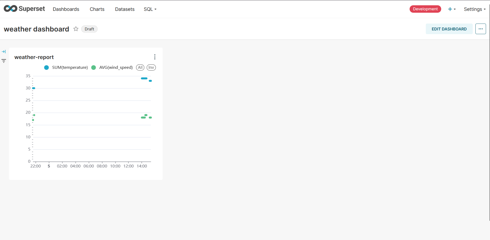
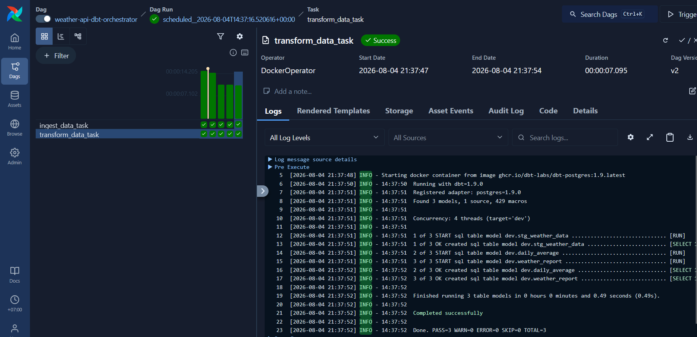

<h1 align="center"># learn-airflow-docker-DataEng</h1>
<h3 align="center">cr. https://www.youtube.com/watch?v=vMgFadPxOLk</h3>

  

<h3 align="center">Superset's Graph</h3>

  

<h3 align="center">Airflow's DAGs</h3>
 
